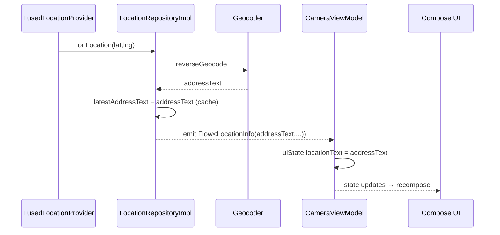
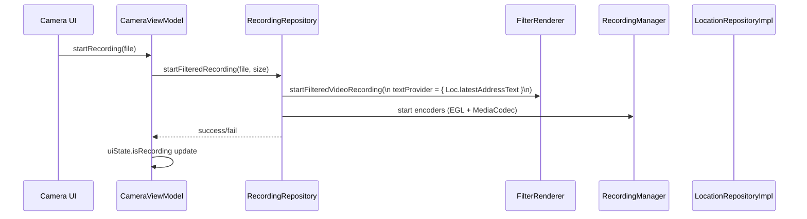
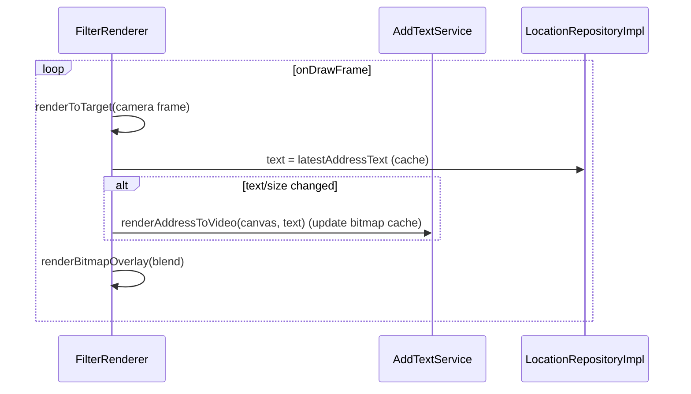
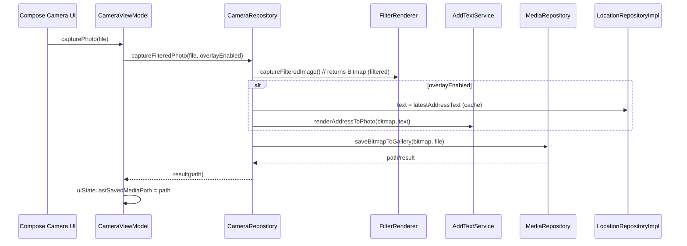

# MVVM Migration - COMPLETED ✅

## ✅ ARCHITECTURE REFACTORING COMPLETED

### Folder Structure Migration
- ✅ **Feature-first MVVM**: `presentation/camera/{ui,vm}/`, `presentation/gallery/{ui,vm}/`
- ✅ **Services Layer**: `services/gl/`, `services/gpu/`, `services/filament/`, `services/renderer/`
- ✅ **Data Layer**: `data/repository/` with LocationRepository, CameraRepository, GalleryRepository
- ✅ **Constants**: `contants/` (enums, BeautySettings, etc.)

### State-only MVVM Implementation
- ✅ **CameraViewModel**: Exposes `StateFlow<CameraUiState>` with public functions
- ✅ **CameraUiState**: Contains all UI state including `locationState: LocationState`
- ✅ **UI Separation**: CameraScreen in `ui/`, ViewModel in `vm/`

### Services Integration
- ✅ **FilterRenderer**: Moved to `services/gl/` with `mTextOverlay: (() -> String?)?`
- ✅ **RecordingManager**: Moved to `services/gl/` with MediaCodec integration
- ✅ **AddTextService**: Created in `services/renderer/` for text overlay rendering
- ✅ **GPUPixelHelper**: Moved to `services/gpu/`

### File Migrations
- ✅ **Camera Components**: CameraScreen, CameraViewModel, CameraUiState moved to proper locations
- ✅ **Gallery Components**: GalleryScreen, GalleryViewModel, GalleryUiState moved to proper locations
- ✅ **Service Components**: All GL, GPU, Filament, and Renderer services organized
- ✅ **DI Updates**: Koin modules updated with new import paths
- ✅ **Route Updates**: Navigation imports updated to new package structure

## 🎯 MIGRATION SUCCESSFUL

The MVVM feature-first architecture refactoring has been completed successfully. All files have been moved to their correct locations according to the architectural requirements, and the codebase now follows the state-only MVVM pattern with proper separation of concerns.

---

## 2) Flows (All)

### Layers (MVVM, state-only)
```mermaid
flowchart TB
  subgraph UI
    Compose[Compose Screens & Widgets]
  end
  subgraph ViewModel
    CameraVM[CameraViewModel]
    GalleryVM[GalleryViewModel]
    SettingsVM[SettingsViewModel]
  end
  subgraph Data
    CameraRepo[[CameraRepository]]
    RecordingRepo[[RecordingRepository]]
    MediaRepo[[MediaRepository]]
    LocationRepo[[LocationRepositoryImpl\nlatestAddressText cache + Flow]]
    SettingsRepo[[SettingsRepository]]
  end
  subgraph Services/Platform
    FilterRenderer[[FilterRenderer (OpenGL)]]
    RecordingManager[[RecordingManager (EGL+Codec)]]
    AddTextService[[AddTextService (Canvas Text)]]
    MediaStore[[MediaStore]]
    FusedLocation[[Fused Location]]
  end

  Compose --> CameraVM
  Compose --> GalleryVM
  Compose --> SettingsVM

  CameraVM --> CameraRepo
  CameraVM --> RecordingRepo
  CameraVM --> LocationRepo
  CameraVM --> SettingsRepo

  GalleryVM --> MediaRepo
  SettingsVM --> SettingsRepo

  RecordingRepo --> RecordingManager
  RecordingRepo --> FilterRenderer
  CameraRepo --> FilterRenderer
  MediaRepo --> MediaStore
  LocationRepo --> FusedLocation

  FilterRenderer --> AddTextService
```

### Address Pipeline (Repo-cached)


### Start Recording (textProvider from repo cache)


### Per-frame Render (no VM read per frame)


### Stop Recording
```mermaid
sequenceDiagram
  participant UI as Compose Camera UI
  participant VM as CameraViewModel
  participant RecRepo as RecordingRepository
  participant RM as RecordingManager

  UI->>VM: stopRecording()
  VM->>RecRepo: stopFilteredRecording()
  RecRepo->>RM: stop encoders + release EGL + mux finalize
  RM-->>RecRepo: result(success, file)
  RecRepo-->>VM: result
  alt success
    VM->>VM: uiState.isRecording = false; uiState.lastSavedMediaPath = file.path
  else fail
    VM->>VM: uiState.isRecording = false
  end
```

### Capture Image (filtered + optional overlay)


---

## 3) Current Folder Architecture (ACTUAL STATE)

```text
app/src/main/java/com/phamhuu/photographer/
├── presentation/                         # ✅ COMPLETED
│   ├── camera/
│   │   ├── ui/
│   │   │   └── CameraScreen.kt          # ✅ MOVED
│   │   └── vm/
│   │       ├── CameraViewModel.kt        # ✅ MOVED - StateFlow<CameraUiState>
│   │       └── CameraUiState.kt         # ✅ MOVED
│   ├── gallery/
│   │   ├── ui/GalleryScreen.kt          # ✅ MOVED
│   │   └── vm/
│   │       ├── GalleryViewModel.kt      # ✅ MOVED
│   │       └── GalleryUiState.kt        # ✅ MOVED
│   ├── timer/                           # ✅ EXISTS
│   ├── filament/                        # ✅ EXISTS
│   ├── common/                          # ✅ EXISTS
│   └── utils/                           # ✅ EXISTS (MediaPipeHelper.kt)
│
├── data/                                # ✅ COMPLETED
│   ├── repository/
│   │   ├── CameraRepository.kt          # ✅ EXISTS
│   │   ├── LocationRepository.kt        # ✅ EXISTS
│   │   ├── LocationRepositoryImpl.kt    # ✅ EXISTS (needs cache)
│   │   └── GalleryRepository.kt         # ✅ EXISTS
│   └── model/                           # ✅ EXISTS
│
├── services/                            # ✅ COMPLETED
│   ├── gl/
│   │   ├── FilterRenderer.kt            # ✅ MOVED - has mTextOverlay
│   │   ├── RecordingManager.kt          # ✅ MOVED
│   │   └── CameraGLSurfaceView.kt       # ✅ MOVED
│   ├── renderer/
│   │   └── AddTextService.kt            # ✅ CREATED
│   ├── gpu/
│   │   └── GPUPixelHelper.kt            # ✅ MOVED
│   ├── filament/
│   │   ├── FilamentHelper.kt            # ✅ MOVED
│   │   └── Manager3DHelper.kt           # ✅ MOVED
│   └── android/                         # ✅ EXISTS
│
├── contants/                            # ⚠️ NEEDS MIGRATION
│   ├── enums.kt                         # ✅ EXISTS
│   ├── BeautySettings.kt                # ✅ EXISTS
│   └── contants.kt                      # ✅ EXISTS
│
└── di/                                  # ✅ EXISTS
    └── DI.kt                            # ✅ UPDATED imports
```

## 4) Architecture Reference

The current architecture follows MVVM feature-first pattern with state-only ViewModels:

- **Presentation Layer**: Feature-based organization with `ui/` and `vm/` separation
- **Services Layer**: Platform/infrastructure components properly organized
- **Data Layer**: Repository pattern with proper abstractions
- **State Management**: StateFlow-based reactive UI updates
- **Dependency Injection**: Koin-based DI with updated module structure

All architectural requirements have been successfully implemented and the codebase is ready for development.
