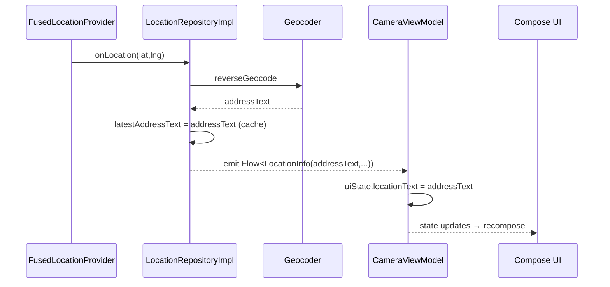
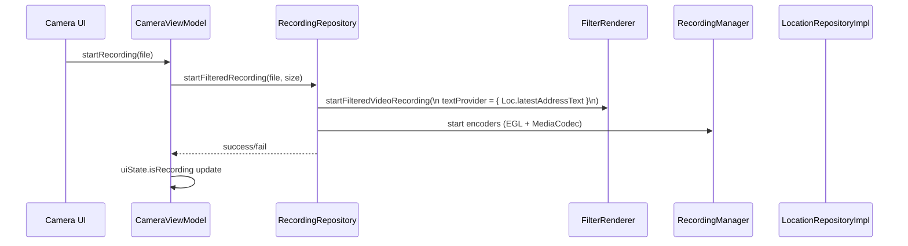
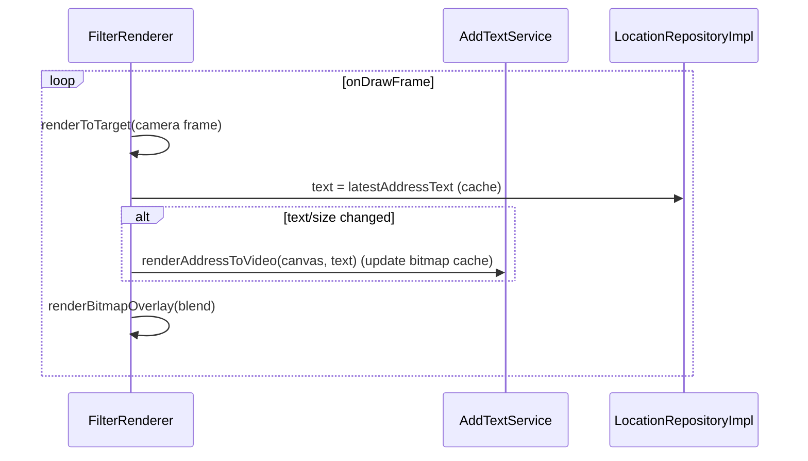
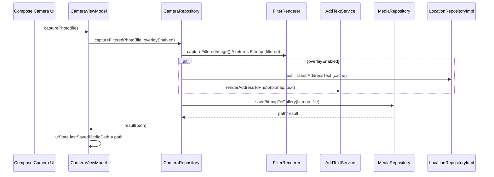

# MVVM Migration - Consolidated Plan

## 1) Task Breakdown (State-only MVVM + Repo-cached Address)

- Repository & Data Foundations
  - Implement/verify `LocationRepositoryImpl` with:
    - `latestAddressText: String?` in-memory cache (volatile/atomic) updated after reverse geocode
    - `Flow<LocationInfo>` for UI updates
    - `getLatestAddressText(): String?` for fast reads from render thread
  - Ensure `RecordingRepository`, `CameraRepository`, `MediaRepository` interfaces and implementations exist and are wired

- Renderer & Recording Integration
  - `FilterRenderer.startFilteredVideoRecording(textProvider = { locationRepo.getLatestAddressText() })`
  - Keep overlay bitmap cache; only re-render when text or output size changes
  - `RecordingManager.renderToEncoderSurface { … }` uses single-callback to render camera then overlay

- ViewModel (state-only) and UI
  - `CameraViewModel` exposes `StateFlow<CameraUiState>`
  - Public functions: `startRecording(file)`, `stopRecording()`, `capturePhoto(file)`, `toggleLocationEnabled(enabled)`, `applyFilter(id)`
  - Compose observes `uiState` and calls ViewModel methods directly

- Capture Photo Path
  - After `FilterRenderer.captureFilteredImage()`, if overlay enabled
    - Read text from `LocationRepositoryImpl.getLatestAddressText()`
    - `AddTextService.renderAddressToPhoto(bitmap, text)`
    - Save via `MediaRepository`

- DI Wiring (Koin)
  - Provide repositories, services (`FilterRenderer`, `RecordingManager`, `AddTextService`), and ViewModels

- Performance & Testing
  - Confirm per-frame does not read ViewModel; reads repo cache O(1)
  - Verify bitmap cache prevents GC churn; recreate only on size change
  - Unit tests: `LocationRepositoryImpl` (cache + Flow), `CameraViewModel` (state changes)
  - Integration: recording overlay shows address when cache has value

- Acceptance Criteria
  - UI has no business logic; state-only ViewModels
  - Recording/overlay use repo-cached address (no VM reads per frame)
  - Photo and video overlays consistent and performant

---

## 2) Flows (All)

### Layers (MVVM, state-only)
```mermaid
flowchart TB
  subgraph UI
    Compose[Compose Screens & Widgets]
  end
  subgraph ViewModel
    CameraVM[CameraViewModel]
    GalleryVM[GalleryViewModel]
    SettingsVM[SettingsViewModel]
  end
  subgraph Data
    CameraRepo[[CameraRepository]]
    RecordingRepo[[RecordingRepository]]
    MediaRepo[[MediaRepository]]
    LocationRepo[[LocationRepositoryImpl\nlatestAddressText cache + Flow]]
    SettingsRepo[[SettingsRepository]]
  end
  subgraph Services/Platform
    FilterRenderer[[FilterRenderer (OpenGL)]]
    RecordingManager[[RecordingManager (EGL+Codec)]]
    AddTextService[[AddTextService (Canvas Text)]]
    MediaStore[[MediaStore]]
    FusedLocation[[Fused Location]]
  end

  Compose --> CameraVM
  Compose --> GalleryVM
  Compose --> SettingsVM

  CameraVM --> CameraRepo
  CameraVM --> RecordingRepo
  CameraVM --> LocationRepo
  CameraVM --> SettingsRepo

  GalleryVM --> MediaRepo
  SettingsVM --> SettingsRepo

  RecordingRepo --> RecordingManager
  RecordingRepo --> FilterRenderer
  CameraRepo --> FilterRenderer
  MediaRepo --> MediaStore
  LocationRepo --> FusedLocation

  FilterRenderer --> AddTextService
```

### Address Pipeline (Repo-cached)


### Start Recording (textProvider from repo cache)


### Per-frame Render (no VM read per frame)


### Stop Recording
```mermaid
sequenceDiagram
  participant UI as Compose Camera UI
  participant VM as CameraViewModel
  participant RecRepo as RecordingRepository
  participant RM as RecordingManager

  UI->>VM: stopRecording()
  VM->>RecRepo: stopFilteredRecording()
  RecRepo->>RM: stop encoders + release EGL + mux finalize
  RM-->>RecRepo: result(success, file)
  RecRepo-->>VM: result
  alt success
    VM->>VM: uiState.isRecording = false; uiState.lastSavedMediaPath = file.path
  else fail
    VM->>VM: uiState.isRecording = false
  end
```

### Capture Image (filtered + optional overlay)


---

## 3) Folder Architecture (MVVM, feature-first, state-only)

```text
app/src/main/java/com/phamhuu/photographer/
├── presentation/                         # UI + ViewModel
│   ├── camera/
│   │   ├── ui/
│   │   │   ├── CameraScreen.kt
│   │   │   └── components/
│   │   │       ├── CanvasAddressOverlay.kt
│   │   │       └── ShutterButton.kt
│   │   └── vm/
│   │       ├── CameraViewModel.kt        # exposes StateFlow<CameraUiState>
│   │       └── CameraUiState.kt
│   ├── gallery/
│   │   ├── ui/GalleryScreen.kt
│   │   └── vm/{GalleryViewModel.kt, GalleryUiState.kt}
│   └── settings/
│       ├── ui/SettingsScreen.kt
│       └── vm/{SettingsViewModel.kt, SettingsUiState.kt}
│
├── data/                                 # Repository + DataSource
│   ├── repository/
│   │   ├── CameraRepository.kt
│   │   ├── CameraRepositoryImpl.kt
│   │   ├── RecordingRepository.kt
│   │   ├── RecordingRepositoryImpl.kt
│   │   ├── MediaRepository.kt
│   │   ├── MediaRepositoryImpl.kt
│   │   ├── LocationRepository.kt
│   │   └── LocationRepositoryImpl.kt     # latestAddressText cache + Flow
│   └── datasource/
│       ├── media/MediaStoreDataSource.kt
│       ├── location/FusedLocationDataSource.kt
│       └── camera/CameraDataSource.kt
│
├── services/                             # Platform/infra
│   ├── gl/{FilterRenderer.kt, RecordingManager.kt}
│   ├── renderer/AddTextService.kt
│   ├── gpu/GPUPixelHelper.kt
│   ├── mediapipe/MediaPipeHelper.kt
│   └── filament/FilamentHelper.kt
│
├── common/
│   ├── contants/contants.kt
│   ├── utils/{Permission.kt, Gallery.kt}
│   └── extensions/*
│
└── di/{AppModule.kt, FeatureModules.kt}
```

Notes:
- ViewModel chỉ expose `StateFlow<UiState>` và hàm public; không dùng UiEvent/UiEffect
- Repository wrap Android/GL APIs và cung cấp API suspend
- `LocationRepositoryImpl` giữ `latestAddressText` (cache) và phát Flow cho UI
- `FilterRenderer` nhận `textProvider` đọc từ cache; có bitmap cache nội bộ
