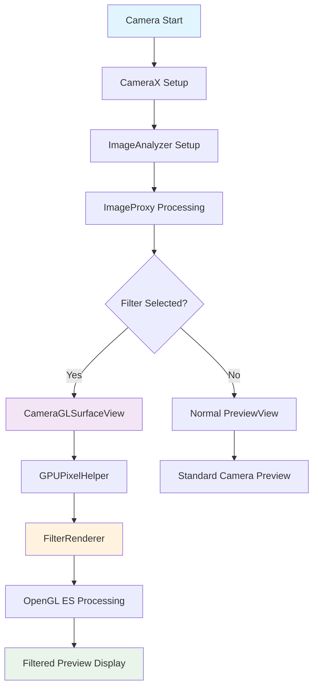
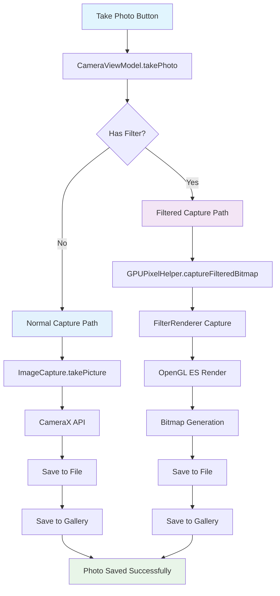
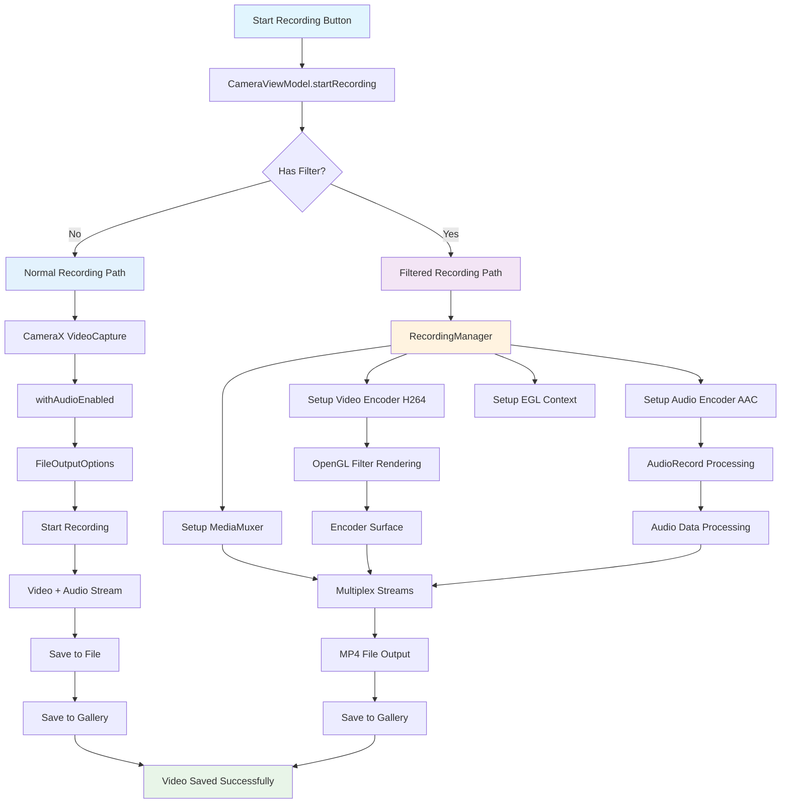

# Photographer

A modern Android camera app with real-time OpenGL ES filters, 3D models, and advanced video recording capabilities.

## Features

- 📸 **Photo Capture**: Normal and filtered photo capture
- 🎥 **Video Recording**: With and without real-time filters
- 🎨 **Real-time Filters**: OpenGL ES-based image processing
- 🎭 **3D Models**: Filament-based 3D model rendering
- 📱 **Modern UI**: Jetpack Compose with Material Design 3
- 🔧 **Advanced Recording**: MediaCodec + MediaMuxer for filtered videos

## Architecture

### 1. Filter Preview Flow

### 2. Photo Capture Flow

### 3. Video Recording Flow

## Technical Details

### Filter Preview Architecture

1. **CameraX ImageAnalyzer** captures camera frames
2. **GPUPixelHelper** processes ImageProxy data
3. **FilterRenderer** applies OpenGL ES filters
4. **CameraGLSurfaceView** displays filtered preview

### Photo Capture Architecture

- **Normal Photos**: Uses CameraX ImageCapture API
- **Filtered Photos**: Uses OpenGL ES rendering pipeline
- **File Management**: Unified save to gallery system

### Video Recording Architecture

- **Normal Videos**: CameraX VideoCapture with audio enabled
- **Filtered Videos**: Custom MediaCodec + MediaMuxer pipeline
- **Audio Processing**: AudioRecord + AAC encoding
- **Video Processing**: H264 encoding with OpenGL ES filters

## Key Components

### RecordingManager
- Manages MediaCodec encoders (H264 video, AAC audio)
- Handles MediaMuxer for stream multiplexing
- Provides EGL context for off-screen rendering
- Uses coroutines for audio processing

### FilterRenderer
- OpenGL ES-based image processing
- Real-time filter application
- GPU-accelerated rendering

### GPUPixelHelper
- Bridges CameraX ImageAnalyzer with OpenGL ES
- Handles ImageProxy to texture conversion
- Manages filter state and rendering

## Dependencies

- **CameraX**: Camera functionality
- **OpenGL ES**: Graphics rendering
- **MediaCodec**: Video/audio encoding
- **Filament**: 3D model rendering
- **Jetpack Compose**: Modern UI
- **Kotlin Coroutines**: Async processing

## Build Requirements

- Android API 28+
- Kotlin 1.9.0+
- Gradle 8.5.0+

## Usage

1. **Normal Photo/Video**: Use standard camera controls
2. **Filtered Content**: Select filter from bottom navigation
3. **3D Models**: Choose 3D model for AR effects
4. **Settings**: Adjust resolution, flash, timer, etc.

## Performance Notes

- Filtered recording uses more CPU/GPU resources
- Audio recording requires RECORD_AUDIO permission
- Large video files may take time to process
- 3D models impact rendering performance